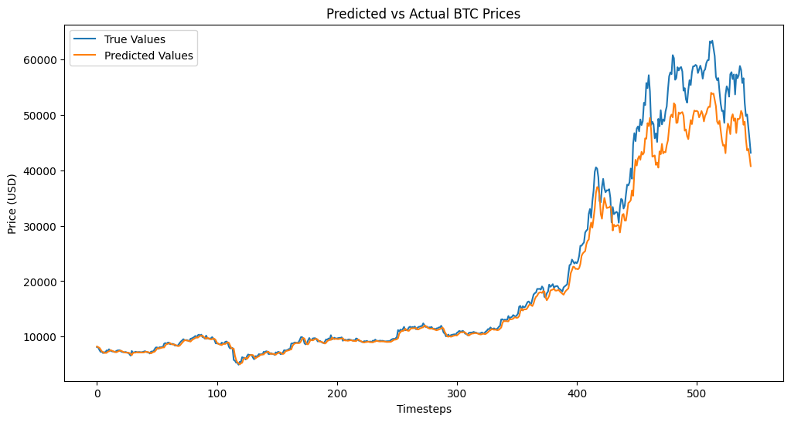

# Bitcoin Price Forecasting with LSTM

## Overview
This project utilizes Long Short-Term Memory (LSTM) networks to forecast Bitcoin prices based on historical data. The dataset was sequentially split into training (80%) and testing (20%) sets to maintain the temporal order, ensuring the model was trained on past data and evaluated on future data. TensorFlow's `tf.data.Dataset` was employed for efficient data handling.

## Data Preparation
The historical Bitcoin price dataset was loaded and processed. The closing prices were extracted and normalized using MinMaxScaler. The sequential split allowed the model to learn from historical trends while ensuring that testing was done on unseen future data.

## Model Architecture
The LSTM model consists of multiple layers designed to capture temporal dependencies in the data. It includes LSTM layers with dropout for regularization, followed by dense layers to produce the final output.

## Training the Model
The model was compiled and trained on the training dataset. After training, predictions were made on the testing dataset.

## Results
The model's predictions were visualized alongside actual Bitcoin prices. The results showed strong performance, with metrics indicating a low Root Mean Squared Error (RMSE) of 3309.22, a Mean Absolute Error (MAE) of 1777.60, and an R² Score of 0.9647. 

 <!-- Replace with the path to your image -->

## Conclusion
The LSTM model effectively forecasts Bitcoin prices, demonstrating significant potential for investment strategy development despite market volatility.

## License
This project is licensed under the MIT License.
